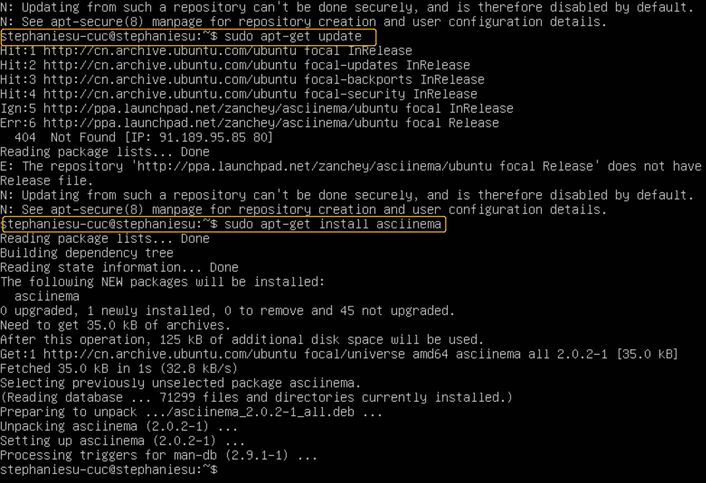
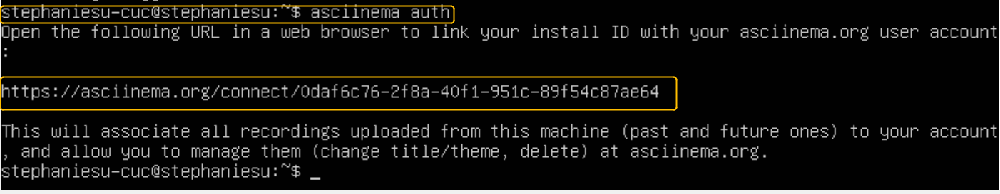

# linux-Linux命令行使用基础

## 一、实验环境

* Virtualbox 
* Ubuntu 20.04 Server 64bit
* Windows 10
* asciinema

## 二、实验目的

1. 下载并配置好asciinema
2. 阅读vimtutor，按照说明进行操作，用asciinema录制操作过程
3. 完成自查清单

## 三、实验过程

### 1.asciinema的安装与使用

1. 依次在虚拟机里键入如下代码：

   ```shell
   $ sudo apt-add-repository ppa:zanchey/asciinema
   $ sudo apt-get update
   $ sudo apt-get install asciinema
   ```

   

2. 运行以下命令，并在浏览器中打开显示的URL，关联终端与在线账户。

   ```shell
   $ asciinema auth
   ```

   

3. asciinema基本操作

   ```shell
   $ asciinema rec
   ```

4. 结束录制

   ```SHELL
   $ exit
   ```

### 2.学习vimtutor

####  基本操作

```shell
$ vimtutor  #开始学习
$ :q! <ENTER>  #退出学习
```

#### lesson 1

* 1.1-1.5 [](https://asciinema.org/a/402816)
* 1.6 [](https://asciinema.org/a/402846)

#### lesson 2

* 2.1-2.4 [](https://asciinema.org/a/402877)
* 2.5-2.7 [](https://asciinema.org/a/402879)

#### lesson 3

* 3.1-3.3 [](https://asciinema.org/a/402884)
* 3.4 [](https://asciinema.org/a/402886)

#### lesson 4

* 4.1-4.2 [](https://asciinema.org/a/402888)
* 4.3-4.4 [](https://asciinema.org/a/402891)

#### lesson 5

* 5.1-5.2 [](https://asciinema.org/a/402900)
* 5.3-5.4 [](https://asciinema.org/a/402904)

#### lesson 6

* 6.1-6.3 [](https://asciinema.org/a/402912)
* 6.4-6.5 [](https://asciinema.org/a/402920)

#### lesson 7

* 7.1-7.2 [](https://asciinema.org/a/402926)
* 7.3 [](https://asciinema.org/a/402944)

## 四、自查清单

1. 你了解vim有哪几种工作模式？

   * 命令模式（Command mode）

     * 用户刚刚启动 vi/vim，便进入了命令模式。

     * 此状态下敲击键盘动作会被Vim识别为命令，而非输入字符。比如我们此时按下i，并不会输入一个字符，i被当作了一个命令。

     * 常用的几个命令：
       * `i` 切换到输入模式，以输入字符。
       * `x` 删除当前光标所在处的字符。
       * `:` 切换到底线命令模式，以在最底一行输入命令。

   * 输入模式（Insert mode）

     在命令模式下按下`i`就进入了输入模式。

     在输入模式中，可以使用以下按键：

     - `字符按键以及Shift组合`，输入字符
     - `ENTER`，回车键，换行
     - `BACK SPACE`，退格键，删除光标前一个字符
     - `DEL`，删除键，删除光标后一个字符
     - `方向键`，在文本中移动光标
     - `HOME/END`，移动光标到行首/行尾
     - `Page Up/Page Down`，上/下翻页
     - `Insert`，切换光标为输入/替换模式，光标将变成竖线/下划线
     - `ESC`，退出输入模式，切换到命令模式

   * 底线命令模式（Last line mode）

     * 在命令模式下按下`:`进入底线命令模式。
     * 底线命令模式可以输入单个或多个字符的命令，可用的命令非常多。
     * 在底线命令模式中，基本的命令有（已经省略了冒号）：
       * `q` 退出程序
       * `w` 保存文件

     * 按`ESC`键随时退出底线命令模式。

   * 可视模式（visual mode）

2. Normal模式下，从当前行开始，一次向下移动光标10行的操作方法？如何快速移动到文件开始行和结束行？如何快速跳转到文件中的第N行？

   * 一次向下移动光标10行：`10j`或`10↓`
   * 移动到文件开始行：`gg`
   * 移动到文件结束行：`G`
   * 移动到这个文件的第 n 行：`nG`

3. Normal模式下，如何删除单个字符、单个单词、从当前光标位置一直删除到行尾、单行、当前行开始向下数N行？

   * 删除单个字符 ：`x`或`dl`
   * 删除单个单词 ：`dw`
   * 从当前光标位置一直删除到行尾 ：`d$`
   * 从当前光标位置一直删除到单行 ：`dd`
   * 从当前光标位置一直删除到当前行开始向下数N行： `Ndd`

4. 如何在vim中快速插入N个空行？如何在vim中快速输入80个-？

   * 插入N个空行
     * 在目前光标所在的**下一行**处输入新的N行 ：`No`+`Esc`
     * 在目前光标所在的**上一行**处输入新的N行 ：`NO`+`Esc`
   * 快速输入80个-： `80i-` + `Esc`

5. 如何撤销最近一次编辑操作？如何重做最近一次被撤销的操作？

   - `u` → undo
   - `<C-r>` → redo

6. vim中如何实现剪切粘贴单个字符？单个单词？单行？如何实现相似的复制粘贴操作呢？

   * 剪切粘贴
     * 单个字符：将光标置于需剪切字符下：`x`，将光标置于需粘贴的字符前：`p`
     * 单个单词： 将光标置于需剪切的单词首字母下：`dw` ，将光标置于需粘贴的字符前：`p`
     * 单行： 光标置于需剪切的一行：`dd` ，前往粘贴的那一行 ：`p`
   * 利用可视模式实现复制粘贴：
     * 按`v`进入可视模式
     * 移动光标选择需要复制的内容，按`y`复制文本，移动光标至指定位置，然后按下`p`粘贴文本

7. 为了编辑一段文本你能想到哪几种操作方式（按键序列）？

   **文本插入操作**

   ```c
   i:  在当前光标的前面插入字符
   a:  在当前光标的后面追加字符
   o:  在当前光标的下一行行首插入字符
   I:  在一行的开头添加文本
   A:  在一行的结尾处添加文本
   O:  在光标当前行的上一行插入文本
   s:  删除当前光标处的字符并进入到插入模式
   S:  删除光标所在处的行，并进入到插入模式
   u:  撤销修改
   ```

   

   **文本删除操作**

   ```c
   #字符删除
   x:  删除当前光标所在处的字符
   X:  删除当前光标左边的字符
   
   #单词删除
   dw:  删除一个单词(从光标处到空格)
   daw:  无论光标在什么位置，删除光标所在的整个单词(包括空白字符)
   diw:  删除整个单词文本，但是保留空格字符不删除
   d2w:  删除从当前光标开始处的2个单词
   d$:  删除从光标到一行末尾的整个文本
   d0:  删除从光标到一行开头的所有单词
   dl:  删除当前光标处的字符=x
   dh:  删除当前光标左边的字符=X
   
   #行删除
   dd:  删除当前光标处的一整行=D
   5dd:  删除从光标开始处的5行代码
   dgg:  删除从光标到文本开头
   dG:  删除从光标到文本结尾
   
   #行合并
   J:  删除一个分行符，将当前行与下一行合并
   ```

   

   **文本复制、剪切与粘贴**

   ```c
   y:  复制，p:粘贴
   yw:  复制一个单词
   y2w:  复制2个单词
   y$:  复制从当前光标到行结尾的所有单词
   y0:  复制从当前光标到行首的所有单词
   yy:  复制一整行
   2yy:  复制从当前光标所在行开始的2行
   
   #复制文本块
       1.首先进入visual模式：v
       2.移动光标选择文本
       3.复制与粘贴的操作
   ```

   **文本的修改与替换**

   ```c
   cw:  删除从光标处到单词结尾的文本并进入到插入模式
   cb:  删除从光标处到单词开头的文本并进入到插入模式
   cc:  删除一整行并进入到插入模式
   ~： 修改光标下字符的大小写
   r:  替换当前光标下的字符
   R:  进入到替换模式
   xp:  交换光标和下一个字符
   ```

   

   **文本的查找与替换**

   ```c
   /string   正向查找
   ?string   反向查找
   
       # 设置高亮显示
       :set hls
       *按键将当前光标处的单词高亮显示，使用n浏览下一个查找高亮的结果
   :s/old/new   将当前行的第一个字符串old替换为new
   :s/old/new/g   将当前行的所有字符串old替换为new
   :90s/old/new/g  将指定行的所有字符串old替换为new
   :90,93s/old/new/g  将指定范围的行的所有字符串old替换为new
   :%s/old/new/g   将文本中所有的字符串old替换为new
   :%s/old/new/gc  依次替换每个字符串关键字
   :%s/^struct/int/g   将所有以struct开头的字符串替换为int
   ```

   

   **文本的撤销修改**

   ```c
   u:  撤销上一步的操作。
   Ctrl+r:  将原来的插销重做一遍
   U：  恢复一整行原来的面貌（文件打开时的文本状态）
   ```

   

8. 查看当前正在编辑的文件名的方法？查看当前光标所在行的行号的方法？

   - 查看文件名：
     * 正常模式下  `:f` 或`CTRL+G`
     * 如果要查看路径 `:!pwd`
   - 显示行号：`: set nu` 取消显示行号：`: set nonu`

9. 在文件中进行关键词搜索你会哪些方法？如何设置忽略大小写的情况下进行匹配搜索？如何将匹配的搜索结果进行高亮显示？如何对匹配到的关键词进行批量替换?

   <!--正常模式下-->

   - 关键词搜索:键入`/`+想要查找的关键词+回车
   - 忽略大小写`:set ic`
   - 将匹配结果高亮显示`:set hls is`
   - 匹配到的关键词进行批量替换:
     - 全局替换：`:%s/old/new/g`
     - 对指定行数（m-n）进行替换：`::m,ns/old/new/g`

10. 在文件中最近编辑过的位置来回快速跳转的方法？

    - 正常模式下执行 `CTRL-O` 和 `CTRL-I`

11. 如何把光标定位到各种括号的匹配项？例如：找到(, [, or {对应匹配的),], or }

    - 先将光标定位到任一的(,[,{ ，键入 `%` 以找到所匹配的),],}

12. 在不退出vim的情况下执行一个外部程序的方法？

    - 按 `:!` 并加上要执行的外部命令。

13. 如何使用vim的内置帮助系统来查询一个内置默认快捷键的使用方法？如何在两个不同的分屏窗口中移动光标？

    - `:help [快捷键名]` + `enter`
    - 在不同的分屏窗口移动光标： `:set mouse=a` 开启vim鼠标支持模式

## 五、参考资料

[Installation - asciinema（官方安装教程） ](https://asciinema.org/docs/installation#installing-on-linux)

[Linux vi/vim | 菜鸟教程 (runoob.com)](https://www.runoob.com/linux/linux-vim.html)
