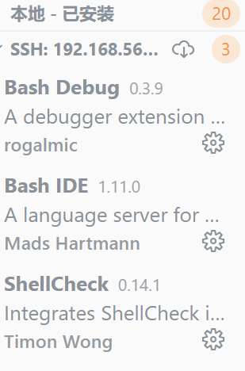

# linux实验四-shell脚本编程基础

## 一、实验环境

* Virtualbox 
* linux Ubuntu 20.04 Server 64bit
* Windows 10
* 软件环境：VScode，连接到虚拟机

## 二、实验报告要求

- 继承[第一章：Linux基础（实验）](https://c4pr1c3.github.io/LinuxSysAdmin/chap0x01.exp.md.html)的所有实验报告要求
- 任务的所有源代码文件必须单独提交并提供详细的**–help**脚本内置帮助信息
- 任务二、三的所有统计数据结果要求写入独立实验报告

## 三、实验过程

### 任务目录

- 任务一：用bash编写一个图片批处理脚本，实现以下功能：
  - 支持命令行参数方式使用不同功能
  - 支持对指定目录下所有支持格式的图片文件进行批处理
  - 支持以下常见图片批处理功能的单独使用或组合使用
    - 支持对jpeg格式图片进行图片质量压缩
    - 支持对jpeg/png/svg格式图片在保持原始宽高比的前提下压缩分辨率
    - 支持对图片批量添加自定义文本水印
    - 支持批量重命名（统一添加文件名前缀或后缀，不影响原始文件扩展名）
    - 支持将png/svg图片统一转换为jpg格式图片

- 任务二：用bash编写一个文本批处理脚本，对以下附件分别进行批量处理完成相应的数据统计任务：
  - 2014世界杯运动员数据
    - 统计不同年龄区间范围（20岁以下、[20-30]、30岁以上）的球员**数量**、**百分比**
    - 统计不同场上位置的球员**数量**、**百分比**
    - 名字最长的球员是谁？名字最短的球员是谁？
    - 年龄最大的球员是谁？年龄最小的球员是谁？

- 任务三：用bash编写一个文本批处理脚本，对以下附件分别进行批量处理完成相应的数据统计任务：
  - Web服务器访问日志
    - 统计访问来源主机TOP 100和分别对应出现的总次数
    - 统计访问来源主机TOP 100 IP和分别对应出现的总次数
    - 统计最频繁被访问的URL TOP 100
    - 统计不同响应状态码的出现次数和对应百分比
    - 分别统计不同4XX状态码对应的TOP 10 URL和对应出现的总次数
    - 给定URL输出TOP 100访问来源主机

### 实验过程

#### 任务一——用bash编写一个图片批处理脚本

##### 环境准备

* 在终端安装`imagemagick`和``shellcheck`

  ```shell
  sudo apt-get update
  sudo apt-get install -y shellcheck
  sudo apt-get install imagemagick
  ```

* 在vscode安装拓展

  

  

  

##### 结果展示

* 支持对jpeg格式图片进行图片质量压缩

  

* 支持对jpeg/png/svg格式图片在保持原始宽高比的前提下压缩分辨率

  

* 支持对图片批量添加自定义文本水印

* 支持批量重命名（统一添加文件名前缀或后缀，不影响原始文件扩展名）

  * 处理前文件名分别为命名为**1.jpg**、**2.png**、**3.svg**

  * 处理后

    

* 支持将png/svg图片统一转换为jpg格式图片

  

#### 任务二：用bash编写一个文本批处理脚本，对以下附件分别进行批量处理完成相应的数据统计任务

##### 结果展示

- 统计不同年龄区间范围（20岁以下、[20-30]、30岁以上）的球员**数量**、**百分比**

  ```shell
  $ bash task-2.sh -s
  
  Age             Count           Percentage
  <20             9               1.222826%
  >=20&&<=30      600             81.521739%
  >30             127             17.255435%
  ```

  

- 统计不同场上位置的球员**数量**、**百分比**

  ```shell
  $ bash task-2.sh -p
      Position    Count   Percentage
      Défenseur   1       0.135870%
     Midfielder   268     36.413043%
       Defender   236     32.065217%
        Forward   135     18.342391%
         Goalie   96      13.043478%
  ```

  

- 名字最长的球员是谁？名字最短的球员是谁？

  ```shell
  $ bash task-2.sh -n
  The longest name is Lazaros Christodoulopoulos
  The longest name is Francisco Javier Rodriguez
  The longest name is Liassine Cadamuro-Bentaeba
  The shortest name is Jô
  ```

  

- 年龄最大的球员是谁？年龄最小的球员是谁？

  ```shell
  $ bash task-2.sh -a
  The oldest age is 42, The name is Faryd Mondragon
  The youngest age is 18, The name is Luke Shaw
  Fabrice Olinga
  ```

  

#### 任务三：用bash编写一个文本批处理脚本，对以下附件分别进行批量处理完成相应的数据统计任务：

##### 结果展示

- 统计访问来源主机TOP 100和分别对应出现的总次数

  ```shell
  $ bash task-3.sh -o
                               TOP100_host        count
                        edams.ksc.nasa.gov        5596
                      piweba4y.prodigy.com        4396
                      piweba5y.prodigy.com        4077
                      www-d1.proxy.aol.com        3578
                      piweba3y.prodigy.com        3542
                              163.206.89.4        3176
                      www-b2.proxy.aol.com        3162
                      www-b3.proxy.aol.com        3133
                               news.ti.com        3112
                      www-c5.proxy.aol.com        3080
                      www-c3.proxy.aol.com        3065
                      www-c2.proxy.aol.com        3050
                      www-d3.proxy.aol.com        3044
                      www-d2.proxy.aol.com        3035
                      www-b5.proxy.aol.com        2990
                      www-d4.proxy.aol.com        2951
                      www-b4.proxy.aol.com        2932
                      www-a2.proxy.aol.com        2928
                      www-c1.proxy.aol.com        2909
                      www-c4.proxy.aol.com        2877
                      www-c6.proxy.aol.com        2852
                      www-a1.proxy.aol.com        2829
                   intgate.raleigh.ibm.com        2736
                    mpngate1.ny.us.ibm.net        2671
                        e659229.boeing.com        2618
                    www-relay.pa-x.dec.com        2495
                      piweba1y.prodigy.com        2439
                          webgate1.mot.com        2261
                         poppy.hensa.ac.uk        1910
        www-proxy.crl.research.digital.com        1717
                        vagrant.vf.mmc.com        1698
                        palona1.cns.hp.com        1685
                               gw2.att.com        1526
                               gw1.att.com        1459
                  trusty.lmsc.lockheed.com        1420
                      disarray.demon.co.uk        1357
                                     derec        1341
                            koriel.sun.com        1255
                              163.205.1.19        1248
                              128.217.62.1        1201
                            163.205.156.16        1198
                  cliffy.lfwc.lockheed.com        1152
                     keyhole.es.dupont.com        1143
                bocagate.bocaraton.ibm.com        1133
                     n1144637.ksc.nasa.gov        1126
                      piweba2y.prodigy.com        1112
                             163.205.3.104        1088
                               gw3.att.com        1088
                            gn2.getnet.com        1060
                      interlock.turner.com        1058
                             163.205.19.20        1025
                           sgigate.sgi.com        1019
             whopkins.sso.az.honeywell.com        980
                       tiber.gsfc.nasa.gov        977
                   bstfirewall.bst.bls.com        968
                              128.217.62.2        938
                        news.dfrc.nasa.gov        852
                            spider.tbe.com        851
                            163.206.137.21        847
                      proxy.austin.ibm.com        832
                           128.159.122.110        827
                           corpgate.nt.com        818
                               gw4.att.com        814
                     n1121796.ksc.nasa.gov        806
                       bbuig150.unisys.com        795
                    jericho2.microsoft.com        786
                   proxy0.research.att.com        782
                             163.205.11.31        776
               gatekeeper.cca.rockwell.com        761
            sdn_b6_f02_ip.dny.rockwell.com        757
                            128.159.144.83        756
                             163.205.16.75        750
                      stortek1.stortek.com        744
                       lamar.d48.lilly.com        727
                      www-c8.proxy.aol.com        725
                    jericho3.microsoft.com        723
                            amdext.amd.com        716
                        sahp315.sandia.gov        707
                         bambi.te.rl.ac.uk        701
                              rmcg.cts.com        701
                             inet2.tek.com        693
                      mac998.kip.apple.com        688
                               206.27.25.1        672
                          igate.uswest.com        671
                      wwwproxy.sanders.com        654
                     n1376232.ksc.nasa.gov        652
                            128.159.132.56        650
                              198.83.19.44        647
                           128.159.122.137        646
                     metabelis.rmit.edu.au        644
                     heimdallp2.compaq.com        642
                        orpheus.amdahl.com        637
                       erigate.ericsson.se        630
                           tia1.eskimo.com        624
                           128.159.111.141        615
                   fkirchman.gsfc.nasa.gov        612
                           139.169.174.102        610
                        pc24.ac.tandem.com        606
                      scooter.pa-x.dec.com        592
                            beta.xerox.com        580
  ```

  

- 统计访问来源主机TOP 100 IP和分别对应出现的总次数

  ```shell
  $ bash task-3.sh -i
             TOP100_IP    count
          163.206.89.4    3176
          163.205.1.19    1248
          128.217.62.1    1201
        163.205.156.16    1198
         163.205.3.104    1088
         163.205.19.20    1025
          128.217.62.2    938
        163.206.137.21    847
       128.159.122.110    827
         163.205.11.31    776
        128.159.144.83    756
         163.205.16.75    750
           206.27.25.1    672
        128.159.132.56    650
          198.83.19.44    647
       128.159.122.137    646
       128.159.111.141    615
       139.169.174.102    610
        141.102.82.127    578
         163.205.23.76    565
       128.159.122.107    563
         163.205.23.93    558
        128.217.62.224    557
         204.62.245.32    556
          199.1.50.225    555
         163.206.140.4    537
       128.159.122.180    522
       199.201.186.103    503
        128.159.122.38    499
        163.206.104.34    490
        163.205.154.11    490
         152.163.192.5    480
           192.77.40.4    480
        128.159.146.40    479
        163.205.16.100    476
         139.169.30.50    454
        140.229.116.37    451
          198.83.19.40    448
       128.159.122.160    447
        163.205.150.22    445
          198.83.19.47    443
        152.163.192.38    432
        163.234.140.22    428
        128.159.122.14    428
         163.205.121.3    426
        128.159.123.58    424
        152.163.192.35    421
       199.201.186.104    420
        128.159.121.34    417
        128.217.61.184    416
         163.205.23.72    415
        152.163.192.71    413
        163.205.12.100    409
        192.112.22.119    407
        152.163.192.70    402
        129.239.68.160    396
        128.159.122.15    393
        152.163.192.36    391
         128.32.196.94    389
         128.217.61.15    389
         163.205.23.71    386
        128.159.121.64    384
         163.206.136.1    384
        152.163.192.69    374
       128.159.122.144    372
        128.159.135.38    369
           204.69.0.27    366
        128.159.135.73    363
        152.163.192.67    359
         130.110.74.81    357
         152.163.192.7    356
          198.83.19.43    354
         163.205.16.90    353
         163.205.23.44    345
         147.74.110.61    342
        193.178.53.180    339
         152.163.192.3    336
          158.27.59.88    336
        163.206.130.46    333
        147.147.191.43    331
        152.163.192.66    328
        128.159.121.41    327
        128.159.63.159    323
        163.205.154.17    322
        128.159.137.43    320
            152.85.3.3    319
          163.205.2.35    318
         163.205.54.76    305
         152.163.192.4    304
         163.205.2.180    302
        163.205.166.15    299
        152.163.192.37    298
         198.246.65.40    297
         139.169.30.22    294
        128.159.135.66    290
          198.83.19.42    290
        199.93.170.211    289
         128.217.63.27    288
       128.159.122.233    286
         128.217.61.98    279
  ```

  

- 统计最频繁被访问的URL TOP 100

  ```shell
  $ bash task-3.sh -u
                                               TOP100_URL count
                               /images/NASA-logosmall.gif 79190
                                /images/KSC-logosmall.gif 65656
                             /images/MOSAIC-logosmall.gif 58741
                                /images/USA-logosmall.gif 58421
                              /images/WORLD-logosmall.gif 57896
                               /images/ksclogo-medium.gif 54695
                                                /ksc.html 38082
                  /history/apollo/images/apollo-logo1.gif 33855
                                  /images/launch-logo.gif 31353
                                                        / 26522
                                 /images/ksclogosmall.gif 24139
             /shuttle/missions/sts-69/mission-sts-69.html 22020
          /shuttle/missions/sts-69/sts-69-patch-small.gif 20692
                                      /shuttle/countdown/ 20476
                          /shuttle/missions/missions.html 20008
                     /shuttle/missions/sts-69/count69.gif 19988
                                 /images/launchmedium.gif 17671
                                          /icons/menu.xbm 10827
                                         /icons/blank.xbm 10758
                                         /icons/image.xbm 9245
                                       /htbin/cdt_main.pl 9205
                                    /history/history.html 9178
                /history/apollo/images/footprint-logo.gif 9165
                               /software/winvn/winvn.html 9030
                  /history/apollo/images/apollo-small.gif 8568
               /history/apollo/images/footprint-small.gif 8365
                              /history/apollo/apollo.html 8157
                                /software/winvn/winvn.gif 7886
                              /software/winvn/wvsmall.gif 7557
                             /software/winvn/bluemarb.gif 7510
                  /shuttle/countdown/video/livevideo2.gif 7029
            /shuttle/resources/orbiters/orbiters-logo.gif 6665
                 /history/apollo/apollo-13/apollo-13.html 6554
                 /shuttle/countdown/images/countclock.gif 6505
                                                 /images/ 6433
                           /images/shuttle-patch-logo.gif 6363
                                  /images/kscmap-tiny.gif 5914
      /history/apollo/apollo-13/apollo-13-patch-small.gif 5758
          /shuttle/technology/sts-newsref/stsref-toc.html 5731
          /shuttle/missions/sts-71/sts-71-patch-small.gif 5036
                                    /images/construct.gif 4953
                          /shuttle/countdown/liftoff.html 4826
                                          /icons/text.xbm 4581
              /shuttle/missions/sts-69/images/images.html 4354
                                       /icons/unknown.xbm 4316
          /shuttle/missions/sts-70/sts-70-patch-small.gif 4292
                          /images/shuttle-patch-small.gif 4271
                                   /facilities/lc39a.html 4029
              /shuttle/missions/sts-69/movies/movies.html 4006
               /shuttle/resources/orbiters/endeavour.html 3993
                   /history/apollo/images/apollo-logo.gif 3928
                    /shuttle/missions/sts-69/liftoff.html 3674
             /shuttle/missions/sts-70/mission-sts-70.html 3657
                                   /images/lc39a-logo.gif 3628
           /shuttle/resources/orbiters/endeavour-logo.gif 3428
                                      /htbin/cdt_clock.pl 3309
             /shuttle/technology/sts-newsref/sts_asm.html 3286
              /shuttle/missions/sts-71/movies/movies.html 3136
             /shuttle/missions/sts-71/mission-sts-71.html 2823
                 /history/apollo/apollo-11/apollo-11.html 2805
              /shuttle/missions/sts-70/images/images.html 2800
              /shuttle/missions/sts-71/images/images.html 2694
   /shuttle/technology/images/srb_mod_compare_1-small.gif 2529
   /shuttle/technology/images/srb_mod_compare_3-small.gif 2489
                        /shuttle/countdown/countdown.html 2451
             /shuttle/missions/sts-73/mission-sts-73.html 2425
      /history/apollo/apollo-11/apollo-11-patch-small.gif 2416
   /shuttle/technology/images/srb_mod_compare_6-small.gif 2402
                                          /images/faq.gif 2338
                                         /elv/elvpage.htm 2312
                 /shuttle/missions/51-l/mission-51-l.html 2106
          /shuttle/missions/sts-73/sts-73-patch-small.gif 2098
              /shuttle/missions/51-l/51-l-patch-small.gif 1989
                                    /facilities/tour.html 1967
              /shuttle/resources/orbiters/challenger.html 1957
                                    /facts/about_ksc.html 1928
                                 /images/kscmap-small.gif 1908
                                           /htbin/wais.pl 1897
                            /history/mercury/mercury.html 1880
        /shuttle/missions/sts-71/movies/sts-71-launch.mpg 1831
                                 /images/mercury-logo.gif 1820
                            /images/launchpalms-small.gif 1803
                                        /elv/elvhead3.gif 1768
                                     /facilities/vab.html 1759
                    /history/apollo/apollo-spacecraft.txt 1754
                                     /images/whatsnew.gif 1742
                /shuttle/resources/orbiters/columbia.html 1736
            /history/apollo/apollo-13/apollo-13-info.html 1733
          /shuttle/resources/orbiters/challenger-logo.gif 1722
                                          /whats-new.html 1687
                                    /images/vab-small.gif 1686
                                      /images/ksclogo.gif 1683
                                         /elv/endball.gif 1671
                                 /elv/PEGASUS/minpeg1.gif 1643
                                     /elv/SCOUT/scout.gif 1633
                                     /elv/DELTA/delta.gif 1629
                                     /elv/TITAN/titan.gif 1618
                             /elv/ATLAS_CENTAUR/atlas.gif 1617
              /shuttle/missions/sts-70/movies/movies.html 1607
                                          /elv/struct.gif 1595
  ```

  

- 统计不同响应状态码的出现次数和对应百分比

  ```shell
  $ bash task-3.sh -c
  code    count   percentage
  200     1214993 89.818979%
  302     21376   1.580232%
  304     107494  7.946549%
  403     137     0.010128%
  404     8686    0.642117%
  500     2       0.000148%
  501     25      0.001848%
  ```

  

- 分别统计不同4XX状态码对应的TOP 10 URL和对应出现的总次数

  ```shell
  $ bash task-3.sh -f
                                             code=403 URL count
                  /software/winvn/winvn.html/bluemarb.gif 25
                   /software/winvn/winvn.html/wvsmall.gif 25
                     /software/winvn/winvn.html/winvn.gif 25
                      /ksc.html/images/ksclogo-medium.gif 9
                    /ksc.html/images/MOSAIC-logosmall.gif 8
                     /ksc.html/images/WORLD-logosmall.gif 8
                      /ksc.html/images/NASA-logosmall.gif 8
                       /ksc.html/images/USA-logosmall.gif 8
                 /ksc.html/shuttle/missions/missions.html 4
                           /ksc.html/facts/about_ksc.html 4
                                             code=404 URL count
                                    /pub/winvn/readme.txt 1139
                                   /pub/winvn/release.txt 1002
             /shuttle/missions/STS-69/mission-STS-69.html 560
                                    /images/nasa-logo.gif 319
                 /shuttle/missions/sts-68/ksc-upclose.gif 226
                                    /elv/DELTA/uncons.htm 198
                /history/apollo/sa-1/sa-1-patch-small.gif 181
                              /images/crawlerway-logo.gif 148
                              /://spacelink.msfc.nasa.gov 141
              /history/apollo/a-001/a-001-patch-small.gif 130
  ```

  

- 给定URL输出TOP 100访问来源主机

  ```shell
  $ bash task-3.sh -s /software/winvn/winvn.html/wvsmall.gif
                               TOP100_host        count
                       tty18-23.swipnet.se        7
                           bass.hooked.net        6
              dialup539.washington.mci.net        4
                          rserio.charm.net        4
                   foxlake.library.nwu.edu        3
                           chum.hooked.net        1
  ```

  

## 四、参考资料

- [awk命令详解](https://blog.csdn.net/weixin_41477980/article/details/89511954)
- [老师的课件](https://c4pr1c3.github.io/LinuxSysAdmin/chap0x01.exp.md.html#/-iso)
- [老师的B站视频](https://www.bilibili.com/video/BV1Hb4y1R7FE?p=81&spm_id_from=pageDriver)